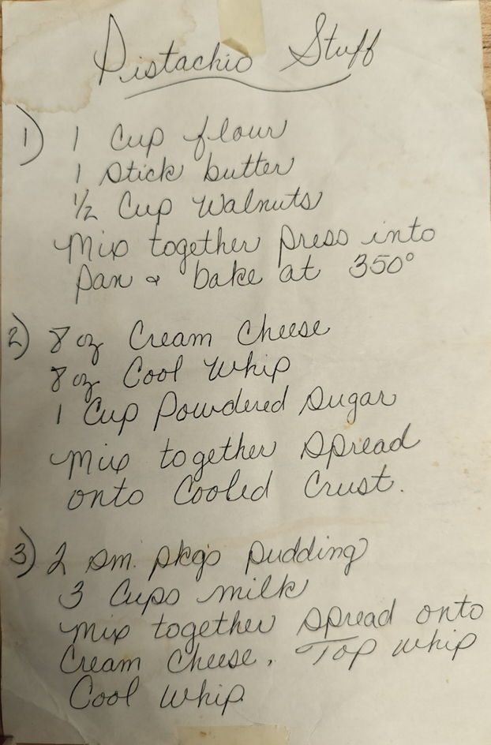

# Pistachio Stuff

## Ingredients

### Group A
- 1 cup flour
- 1 stick butter
- 1/2 cup walnuts
  - *Pistachios might be a good idea here, but the recipe doesn't call for them.*

### Group B
- 8 ounces cream cheese
- 8 ounces cool whip
- 1 cup powdered sugar

### Group C
- 2 small packages of pudding
  - *The text is hard to read here, but I think it says "pkgs". Not sure what kind of pudding either.*
- 3 cups milk

## Directions
1. Mix Group A ingredients together, pour into pan and bake at 350 degrees fahrenheit
2. Mix Group B ingredients together and spread onto cooled crust from Group A
3. Mix Group C ingredients together and spread on top of group B ingredients on crust.
4. Top with cool whip as needed